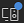
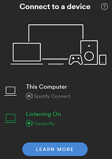

# Gesturify
MIT 6.835 Spring 2018 Final Project - [Hiram Moncivais](https://github.com/FancyVase) and [Maryam Archie](https://github.com/maryam-a)

## Overiew
Maximize productivity with gestures + speech + Spotify

## Code Structure
| Directory/ File | Purpose |
| ---- | ------- |
| `images`| Image files for the README |
| `public` | Contains all client-side code |
| `public/css` | Contains all CSS files |
| `public/css/main.css` | Custom CSS for Gesturify |
| `public/css/**, !public/css/main.css` | External CSS libraries |
| `public/js` | Contains all client-side JavaScript files |
| `public/js/constants.js` | Frequently used constant values |
| `public/js/gestures.js` | Gesture recognition code |
| `public/js/main.js` | Main script that triggers commands based on frame data from the Leap Motion controller. Manipulates the DOM. |
| `public/js/setupSpeech.js` | Sets up the Web Speech API |
| `public/js/spotify.js` | Sets up the Spotify Web Player SDK and contains function calls to the Spotify APIs |
| `public/lib` | External JavaScript libraries | 
| `app.js` | Creates a server and the Spotify authentication flow |
| `package.json` | Lists required packages |

## Requirements
- [Node.js + npm](https://nodejs.org/en/)
- Leap Motion Controller + [SDK](https://developer.leapmotion.com/get-started/)
- Microphone
- Headphones _(for best performance, but not necessary)_
- [Spotify (Desktop/ Mobile/ Web)](https://www.spotify.com/us/download/)
- A Spotify Premium account - Spotify only allows playback control of Premium accounts. You can sign up for a [30 day free trial](https://www.spotify.com/premium/) if you want to test our app.
- Replace application credentials in `app.js` (described below)

### Using your own credentials: 
(*Adapted from [Spotify's Web Authentication Examples](https://github.com/spotify/web-api-auth-examples)*)

You will need to register your app and get your own credentials from the Spotify for Developers Dashboard.

To do so, go to [your Spotify for Developers Dashboard](https://beta.developer.spotify.com/dashboard) and create your application. For the examples, we registered these Redirect URIs:

* http://localhost:8888 (needed for the implicit grant flow)
* http://localhost:8888/callback

Once you have created your app, replace the `client_id`, `redirect_uri` and `client_secret` in `app.js` with the ones you get from My Applications.

## Installing and Running Gesturify
1. Connect the Leap Motion controller to your laptop and ensure that SDK has been installed by searching for the Leap Motion Visualizer on your personal computer. 
1. Navigate to the root of folder containing the Gesturify code.
2. Open a terminal and run `npm install`.
3. Run the app locally with `node app.js`.
4. Navigate to `localhost:8888` in your preferred browser.
5. After logging in with your Spotify Premium account, open the Spotify app on any of your devices and click the `Devices Available` icon . Choose Gesturify from the `Connect to a device` pop up.

6. Return to the browser and try Gesturify!

## Actions
| Feature              | Trigger + Description |
|----------------------|-----------------------|
| Seek                 | Rotate the tip of the finger in the clockwise direction to fast forward the song, anti-clockwise to rewind. |
| Play/ Pause          | Extend the hand out to play/ pause the current song if paused/ playing. |
| Next/ Previous Song  | Close hand and extend thumb left to skip to the next song or to the right to skip to the previous song. |
| Volume Control       | Say "change volume" and then swipe up to raise the volume or down to lower it. Close your fist or say "set volume" to exit volume mode. |
| Search               |  Say "search" followed by the type of item you’re searching for. You can search for a "song", "artist", "album", or "playlist". Afterwards say your search query. Example: *Search song Stay Frosty Royal Milk Tea* |
| Add Current Song to Playlist | In the Gesturify user interface, click the `Add To Playlist` button, point to a playlist and say "Add this song to that playlist".|
